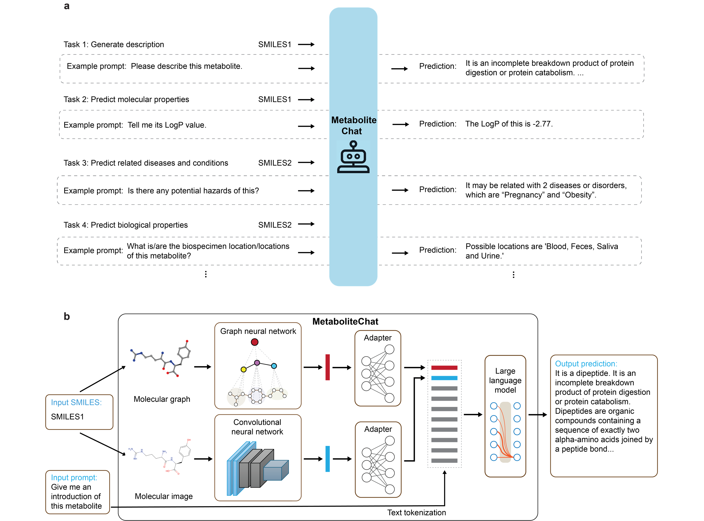

# NAME

This repository holds the code of MetaboliteChat. Read the biorxiv [preprint](!!!).


## Introduction
MetaboliteChat is a multimodal large language model (LLM) designed for metabolite research. It integrates molecular structures (SMILES), molecular images, and natural language prompts to generate free-form predictions and explanations.
In drug discovery and metabolomics, conventional approaches often require task-specific models that lack generalization. In contrast, MetaboliteChat leverages the open-ended reasoning ability of LLMs to:
- Support multimodal inputs (graphs, images, and text).  
- Provide free-text outputs rather than constrained classification or regression labels.  
- Enable multi-turn conversational reasoning, allowing researchers to iteratively explore and refine insights about metabolites.  
Results demonstrate that MetaboliteChat outperforms both generic LLMs (e.g., GPT-4o) and task-specific baselines, offering richer and more biologically meaningful predictions for metabolite analysis.
- To train MetaboliteChat, we collected instruction tuning datasets.



## Datasets

Please download the data json files from the [Google drive](https://drive.google.com/drive/folders/1YYTQUJbYBVVoQ8B_P1ZYCUg8JuePQG_L?usp=sharing). The json files contain data for the HMBD(Human Metabolome Database) Instruction Tuning Datasets.


## Getting Started
### System Requirements
- OS: Ubuntu 20.04+ (tested). Other recent Linux distros should work.
- GPU: NVIDIA GPU with ≥80 GB VRAM. Training verified on A100 80 GB (driver 560.35.03).
- CUDA/cuDNN: A CUDA toolkit compatible with your driver (check `nvidia-smi`), plus matching cuDNN.
- Python: 3.9+ via Miniconda/Conda.
- LLM backbone: Vicuna-13B.
- All exact package versions are listed in [`environment.yml`](environment.yml).

You can use the latest NVIDIA driver and Miniconda; the pinned dependencies in `environment.yml` will ensure a consistent environment.

### 1 Prepare the code and environment
```bash
git clone https://github.com/13501274828/MetaboliteChat.git
cd MetaboliteChat
conda env create -f environment.yml
conda activate metabolitechat
```

### Installing RDKit
**To get the data conversion to work properly, you need to create another environment (`rdkit`)**

To create the `rdkit` environment and run the process, run
```
conda create -c conda-forge -n rdkit rdkit
conda activate rdkit
pip install numpy
python dataset/smiles2graph_demo.py
```

**2. Prepare the pretrained Vicuna weights**

The current version of MetaboliteChat is built on Vicuna-13B-v1.5.
Please download Vicuna weights from [https://huggingface.co/lmsys/vicuna-13b-v1.5](https://huggingface.co/lmsys/vicuna-13b-v1.5).
Then, set the path to the vicuna weight in the config file

Download the GNN and CNN checkpoints from the [Google drive](https://drive.google.com/drive/folders/1DlLzYf7MHHdA09l5Cv3H5KUULmtazwo1?usp=sharing)


### Training
**You need at least 70 GB GPU memory for the training.** 

The training configuration file is [train_configs/metabolitechat.yaml](train_configs/metabolitechat.yaml). You may want to change the number of epochs and other hyper-parameters there, such as `max_epoch`, `init_lr`, `min_lr`,`warmup_steps`, `batch_size_train`. You need to adjust `iters_per_epoch` so that `iters_per_epoch` * `batch_size_train` = your training set size.

Start training the projection layer that connects the GNN output and the LLaMA model by running:
```
torchrun --nproc_per_node 1 train.py --cfg-path train_configs/metabolitechat.yaml
```
### Evaluation
We provide a checkpoint [here](https://drive.google.com/drive/folders/18KRWlZddQh3wfwPr9bzKB-ieQ8X9Pdkd?usp=sharing) by training on 152,222 metabolites.

## Acknowledgement
+ [MiniGPT-4](https://minigpt-4.github.io/)
+ [Lavis](https://github.com/salesforce/LAVIS)
+ [Vicuna](https://github.com/lm-sys/FastChat)
+ [ImageMol](https://github.com/HongxinXiang/ImageMol)
+ [Snap-stanford-gnn](https://github.com/snap-stanford/pretrain-gnns/)


## License
This repository is under [BSD 3-Clause License](LICENSE.md).
Many codes are based on [MiniGPT-4](https://github.com/Vision-CAIR/MiniGPT-4) with BSD 3-Clause License [here](LICENSE_MiniGPT4.md), which is based on [Lavis](https://github.com/salesforce/LAVIS) with BSD 3-Clause License [here](LICENSE_Lavis.md).


## Disclaimer

This is a prototype system that has not been systematically and comprehensively validated by pharmaceutical experts yet. Please use with caution. Trained models will be released after we thoroughly validate the system with pharmaceutical experts.
